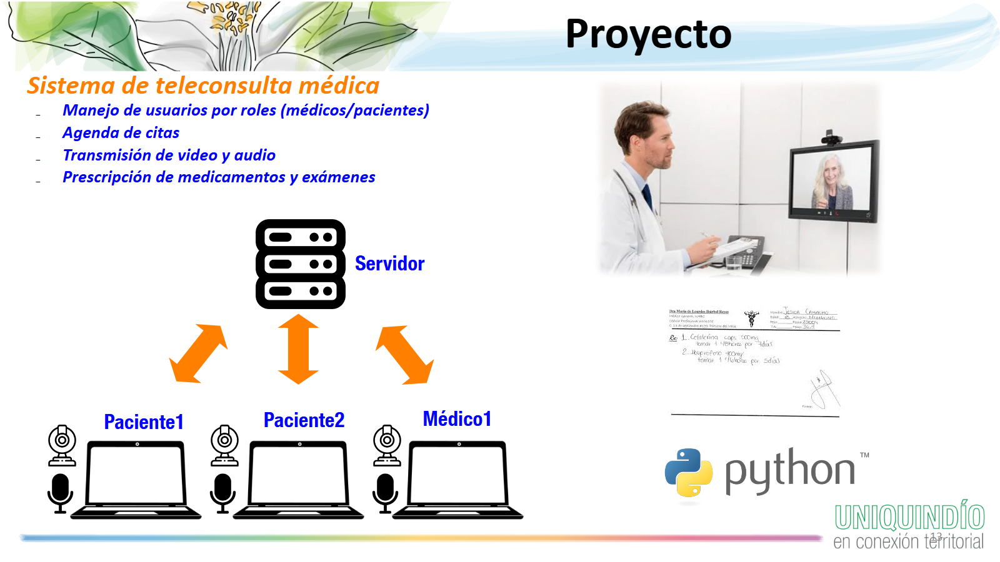

<h1 align="center">
Lab 1: Tipos de Datos Avanzados y Archivos en Python (RA 1, RA 3 y RA 4)  
 </h1>
 

Alexander López-Parrado, PhD.  
Programación, II-2025  
GDSPROC  
Uniquindío  

Con esta práctica de laboratorio se iniciará el desarrollo del código fuente en Python del proyecto del espacio académico. En este caso, y de acuerdo a la arquitectura mostrada en la siguiente figura, se construirá el código del lado del servidor para la gestión de usuarios y citas para el sistema de teleconsulta médica.

En ese sentido, la práctica de laboratorio tiene como propósito la creación de módulos de Python que permitan realizar la gestión de los usuarios (pacientes y médicos) y de las consultas mediante el uso de tipos de datos avanzados como: diccionarios, connjuntos y tuplas; también se usarán archivos de texto y las demás estructuras de programación y tipos de datos estudiados hasta el momento.

## Requerimientos básicos

El sistema de teleconsulta médica debe contar con la capacidad de gestionar pacientes, médicos y citas. Para esto, y en el caso de los pacientes y médicos, el sistema debe contar con las siguientes características minimas:

* Registro de usuarios con la siguiente información:
    - Número de cédula.
    - Nombre y apellidos.
    - Contraseña.
    - Rol (paciente o médico).
* Inicio de sesión en el sistema con almacenamiento de dirección IP (*Internet Protocol*)  [[1]](#1)

Esta IP será utilizada para el establecimiento de la videollamada de la teleconsulta, **cuya implementación se realizará para la segunda entrega del proyecto**. En todo caso, desde ya se debe considerar el almacenamiento de la dirección IP del usuario  [[1]](#1).

De otro lado, para el caso de las consultas médicas, el sistema debe contar con las siguientes características mínimas:

* Creación de consultas con la siguiente información:
    - Número de cédula del paciente.
    - Número de cédula del médico.
    - Fecha y hora de la consulta.
* Registro de la prescripción médica al finalizar la consulta.

Considerando lo anterior, se recomienda que la gestión de la información de usuarios y citas se realice mediante archivos de texto almacenando objetos JSON (*JavaScript Object Notation*) [[2]](#2) desde diccionarios de Python. No se permite el uso de bibliotecas adicionales o bases de datos.

## Reto 1: Representación de información del usuario

Para este reto se debe codificar un programa que permita representar la información de usuarios mediante diccionarios. Escriba un programa que le solicite al usuario su información de registro y que la almacene usando un diccionario.  

## Reto 2: Almacenamiento en archivo de texto de la información del usuario

Modifique el programa del punto anterior para que la información del diccionario sea escrita en un archivo de texto. Para esto haga uso de la función `dumps` del módulo de Pythoon `json` (`from json import dumps`). El programa debe contar con al menos una función y no debe generar errores durante la creación del archivo mediante un uso apropiado de las excepciones, la función o funciones deben ser añadidas a un nuevo módulo de Python.

## Reto 2: Registro de multiples usuarios

Modifique el módulo de Python del punto anterior para que se puedan registrar múltiples usuarios en el archivo de texto. En el caso de que el usuario ya exista en el archivo de texto, la función debe retornar una cadena indicando el error, en caso contrario deberá retornar una cadena indicando el registro exitoso.

## Reto 3: Inicio de sesión del usuario

Para este reto deberá añadir al módulo de Python una función para permitir el inicio de sesión de un usuario registrado. Esta función debe verificar que el usuario existe y que ha proporcionado una contraseña correcta, en ese caso deberá incluirse un nuevo campo en el diccionario para indicar que la sesión está activa. En el nuevo campo puede almacenar el valor que desee, teniendo en cuenta que para la segunda entrega del proyecto en ese campo se almacenará la dirección IP del usuario.

## Reto 4: Gestión de consultas médicas

Para este reto incorporará elementos de los retos anteriores con el fin de crear un módulo de Python para la gestión de citas médicas. El módulo debe incluir al menos una función que permita:

* Agendar consulta con un médico en una fecha y hora específica, el médico debe existir como usuario registrado.
* El paciente debe haber iniciado sesión para poder agendar una consulta. 
* Las citas deben ser almacenadas en un archivo de texto como objetos JSON desde diccionarios de Python, de forma similar a lo realizado para los usuarios.

## Entrega del laboratorio

El laboratorio debe ser presentado mediante:

1. Repositorio en GitHub.
2. Informe de laboratorio.

El informe de laboratorio y el enlace al repositorio de GitHub deben ser compartidos en el enlace dispuesto para tal fin en la plataforma Google Classroom.

## Referencias

<a id="1">[1]</a> 
Geeks for Geeks, "What is an IP Address?",url=[https://www.geeksforgeeks.org/computer-science-fundamentals/what-is-an-ip-address/
](https://www.geeksforgeeks.org/computer-science-fundamentals/what-is-an-ip-address/
).

<a id="2">[2]</a> 
W3schools, "Javascript JSON",url=[https://www.w3schools.com/js/js_json.asp](https://www.w3schools.com/js/js_json.asp).

